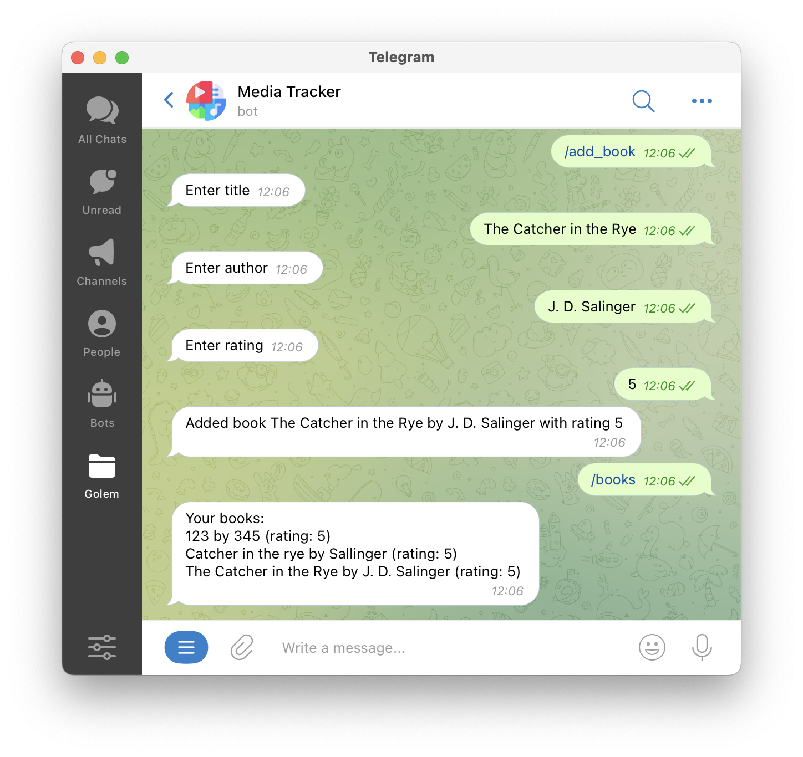
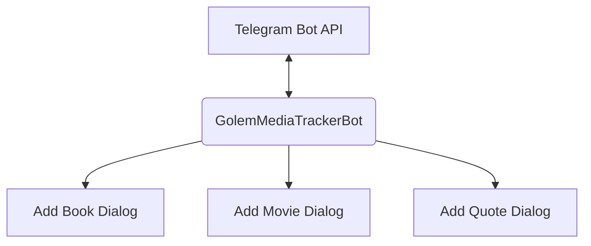
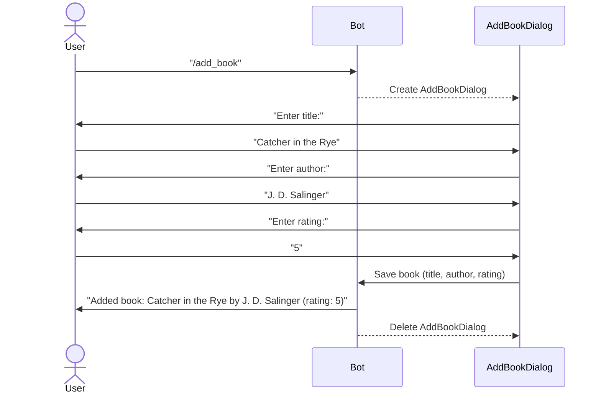

# GolemMediaTrackerBot

A Telegram chatbot to track your media consumption: add books read, movies watched and favorite quotes.

## Built with Golem Cloud

**Golem**: https://www.golem.cloud

The main bot worker [golem-telegram-bot.wit](bot/wit/golem-telegram-bot.wit) runs as a single instance, is responsible for getting updates from Telegram Bot API and manages user dialogs.

Each bot's dialog (add book/movie/quote) is implemented as a separate Golem template ([add-book-dialog.wit](add_book_dialog/wit/add-book-dialog.wit), [add-movie-dialog.wit](add_movie_dialog/wit/add-movie-dialog.wit), [add-quote-dialog.wit](add_quote_dialog/wit/add-quote-dialog.wit)). 
When a user starts one of these dialogs, the bot creates a Golem worker from the corresponding template and stores the key-value pair: Telegram user id/id of the created worker.
Dynamic creation of new workers is done via Golem's REST API.

Thus, when the `/add_book` command is received, the bot creates a worker from the [add-book-dialog.wit](add_book_dialog/wit/add-book-dialog.wit) template. 
All subsequent messages from this user are passed to the active dialog (add-book-dialog worker) until it completes its work, i.e. returns the result of the dialog (in this case it is a book object: title, author and rating). 
After that, the bot removes the worker from the Golem Cloud and deletes the record about it from memory.

This way, Golem takes care of saving the current state of the dialogs, and I don't have to think about explicitly saving that data to external storage in case the bot is updated or crashed.

**High-level architecture:**

**Single dialog flow:**

## Disclaimer

Golem Cloud is currently in preview for developers. 
This bot is a proof of concept and is not intended to store important information. 
Currently, added entities are only stored in the bot's memory in Golem Cloud.
